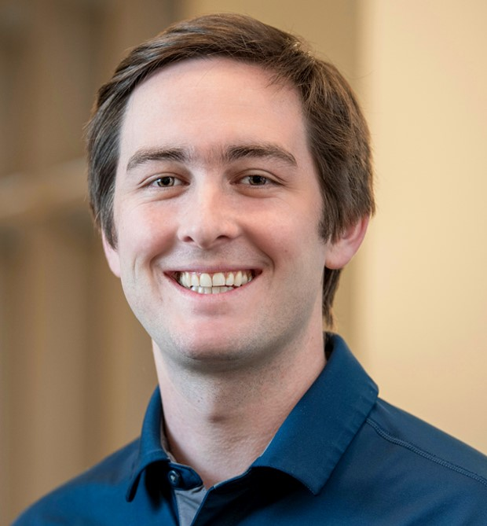

:::: {.hero}
{.headshot}

::: {.hero-text}
# Patrick McQuestion

Candidato a Doctorado, Estudios de Paz y Ciencia Política Instituto Kroc de Estudios Internacionales de Paz, Universidad de Notre Dame

[Google Scholar](https://scholar.google.com/citations?user=D6T5uPcAAAAJ&hl=en&oi=ao){target="_blank"}
[ORCID](https://orcid.org/my-orcid?orcid=0000-0003-0713-3642){target="_blank"}
[CV](vitae.qmd)
[Correo](mailto:pmcquest@nd.edu)

:::
::::

## Sobre mí

Soy candidato a doctorado en Estudios de Paz y Ciencia Política en el Instituto Kroc de Estudios Internacionales de Paz de la Universidad de Notre Dame, donde soy Presidential Fellow en Humanidades y Ciencias Sociales y Doctoral Student Affiliate del Instituto Kellogg de Estudios Internacionales. Mi tesis doctoral, *"Mining for Peace: Conflict Settlements and Extractivism in Colombia and Peru"* (Minería para la paz: acuerdos de conflicto y extractivismo en Colombia y Perú), examina cómo el tipo de acuerdo de conflicto — acuerdos parciales negociados en Colombia frente a la victoria militar en Perú — moldea la gobernanza subnacional de las industrias extractivas. A partir de análisis histórico comparado, entrevistas originales e investigación de archivo, mi trabajo rastrea cómo los procesos de paz abren canales duraderos de rendición de cuentas entre comunidades, empresas y el Estado, y cómo su ausencia habilita una gobernanza de recursos más asimétrica, y en ocasiones criminalizada.

Mi investigación también se extiende a los estudios de democratización, donde he co-desarrollado un nuevo método para medir la democracia subnacional utilizando datos de Varieties of Democracy (V-Dem). También escribo sobre política de formalización, economías de minería ilegal, y el papel de la sociedad civil — incluida la Iglesia Católica en la Amazonía peruana — en la configuración de la política ambiental.

Antes de comenzar el doctorado, fui Investigador Asociado del Peace Accords Matrix del Instituto Kroc, dando seguimiento a la implementación del acuerdo de paz colombiano de 2016, y Analista Técnico en el Ministerio de Modernización de Argentina. Tengo una Maestría en Gestión y Política de Desarrollo de la Universidad de Georgetown y la Universidad Nacional de San Martín (Argentina), y una Licenciatura en Literatura Inglesa de Reed College. También coordino el podcast [*Global Stage*](https://kellogg.nd.edu/kellogg-podcasts/) del Instituto Kellogg.

::: {.contact-block}
**Oficina:** O-111 Hesburgh Center, Notre Dame, IN 46556
**Correo:** [pmcquest@nd.edu](mailto:pmcquest@nd.edu)
:::
