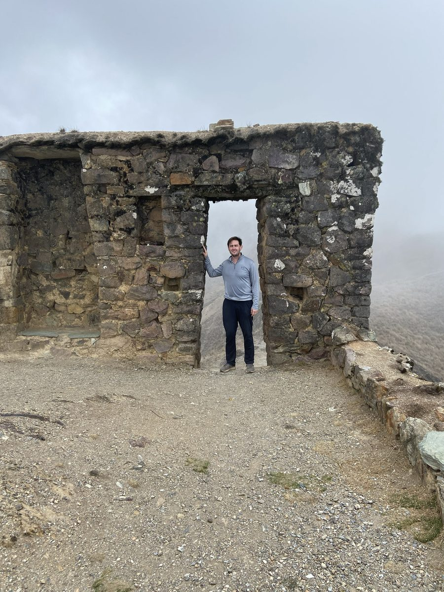

## Filosofía de enseñanza

::: {.page-photo-float}

Ollantaytambo, Perú

:::

Concibo el aula universitaria como un laboratorio tanto de rigor académico como de compromiso social — un espacio para desarrollar habilidades como la expresión oral y el pensamiento crítico, junto con momentos de auténtica conexión intelectual. Mi enseñanza se guía por la convicción de que la ciencia política y los estudios de paz pueden cobrar vida dentro y fuera del aula, ampliando el sentido de propósito de los estudiantes mientras los equipa con habilidades prácticas como la alfabetización de datos y la comunicación pública. En los cursos introductorios, busco tender puentes entre la teoría académica y situaciones del mundo real a través de ejercicios de aprendizaje activo que convierten conceptos abstractos en habilidades comunicativas y analíticas concretas; en los seminarios avanzados, priorizo la metodología y el proceso de construcción de conocimiento, impulsando a los estudiantes a lidiar con datos reales y sus imperfecciones, y a desarrollar una mirada crítica sobre el diseño de investigación.

Este doble enfoque — habilidades orientadas hacia el mundo exterior, y dominio técnico de la producción de conocimiento hacia el interior — está pensado para atraer a estilos de aprendizaje diversos, desde el aspirante a intelectual público hasta el futuro investigador cuantitativo. Ya sea al frente de una clase magistral numerosa o de un seminario reducido, mi objetivo es el mismo: convertir a los estudiantes de consumidores pasivos de información en contribuyentes activos a sus campos de estudio y a la sociedad.

## Experiencia docente

### Asistente de Docencia, Universidad de Notre Dame

2025

*Perspectives on Peacebuilding*, Instituto Kroc de Estudios Internacionales de Paz

2023

*Introduction to Global Politics*, Departamento de Ciencia Política

2023

*Introduction to Peace Studies*, Instituto Kroc de Estudios Internacionales de Paz

### Conferencias Invitadas, Universidad de Notre Dame

2025

"Environmental politics and peacebuilding," para *Perspectives on Peacebuilding*

2023

"Civil War — Trends, Causes, and Microfoundations," para *Introduction to World Politics*

"Do Comprehensive, Inclusive Peace Processes Produce More Sustainable Peace?" para *Introduction to Peace Studies*

